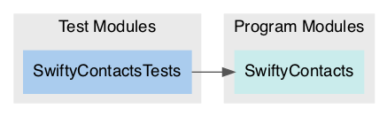

# Package: **SwiftyContacts**

## Products

List of products in this package:

| Product | Type | Targets |
| ------- | ---- | ------- |
| SwiftyContacts | library | SwiftyContacts |

_Libraries denoted 'automatic' can be both static or dynamic._

## Modules

### Program Modules

| Module | Type | Dependencies |
| ------ | ---- | ------------ |
| SwiftyContacts | Regular |  |

### Test Modules

| Module | Type | Dependencies |
| ------ | ---- | ------------ |
| SwiftyContactsTests | Test | SwiftyContacts |

### Module Dependency Graph

## External Dependencies

This package has zero dependencies 🎉

## Requirements

### Minimum Required Versions

| Platform | Version |
| -------- | ------- |
| macOS | 12.0 |
| iOS | 15.0 |
| watchOS | 8.0 |

This file was generated by [SourceDocs](https://github.com/eneko/SourceDocs) on 2021-12-17 14:48:42 +0000